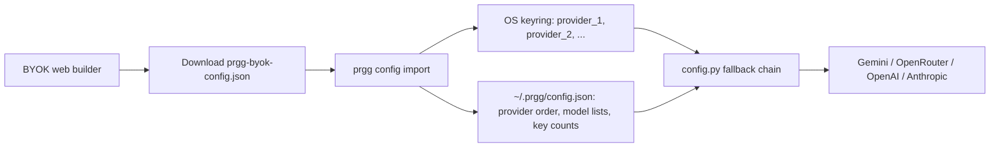

# Deployable Demo Plan

Goal: demo PR Grounding Gate without hosted secrets, while still proving live AI + live GitHub PR analysis works.

## Recommended Demo Shape

Run everything local for the hackathon demo:

- Web app: Vite on `http://127.0.0.1:5174/`.
- CLI: `.\.venv\Scripts\prgg.exe`.
- Secrets: imported into OS keyring via `prgg config import`.
- GitHub: public PR URLs plus Codex GitHub integration for backup metadata.
- Models: Gemini key pool first, then optional OpenRouter/OpenAI/Anthropic fallback.

Do not put provider keys in nginx, a tunnel, browser localStorage, GitHub Pages, or a hosted frontend for the event demo.

## Key Routing



Important demo line: the browser helps create a config file, but the actual run uses local CLI keys from the keyring. The saved event Gemini keys are not committed to the repo and are not printed.

## Platform Choices

### Event Demo

Use local Vite + CLI. This is fastest and safest.

Commands:

```powershell
cd C:\Users\abhin\Projects\codex-hackathon
.\.venv\Scripts\prgg.exe config status
.\.venv\Scripts\prgg.exe check https://github.com/psf/requests/pull/7520
cd vite_ui
npm.cmd run dev -- --host 127.0.0.1 --port 5174
```

### Shareable Demo

Use a static build for the UI and keep the CLI local:

```powershell
cd C:\Users\abhin\Projects\codex-hackathon\vite_ui
npm.cmd run build
```

The static UI can be hosted, but the "Analyze PR" button should still show the local CLI command unless a backend is added.

### Hosted Backend Later

Add a small API bridge only after the hackathon:

- `POST /analyze` accepts a PR URL.
- Server stores provider keys in server-side secrets, never in the browser.
- Worker runs PRGG in an isolated job.
- Results are written to a run artifact and returned to the UI.

Use nginx or a tunnel only to expose the API/webhook endpoint. Do not route provider keys through nginx config.

## Demo Script

1. Open `http://127.0.0.1:5174/`.
2. Start on `Demo Board`.
3. Click npm #9473: merged security PR, but PRGG still says `needs-review` because security claims need proof.
4. Click Requests #7543: tiny metadata PR, claim is mostly true, but 5W evidence is incomplete.
5. Click TensorFlow #120484: GitHub is `OPEN`; explain the internal/superseded caveat.
6. Open `Analyze PR`.
7. Paste `https://github.com/psf/requests/pull/7520`.
8. Show the generated CLI command.
9. In terminal, run the command and show it writes a saved run.
10. Open `BYOK Config` and show arbitrary key pools per provider.

## What Is Done

- Arbitrary-size BYOK pools for Gemini/OpenRouter/OpenAI/Anthropic.
- Gemini live API verified with the imported event keys.
- Round-robin provider key fallback in `config.py`.
- Web BYOK config builder with drag/drop JSON and download.
- Demo board with saved PRGG runs grouped by real GitHub state.
- GitHub connector backup PRs for Flask, Vite, and Django.
- Slopper workflow surfaced as a separate signal, not mixed into the verdict.

## What Is Still Left

- Adopt real repo test commands for selected demo repos so `test_exec` stops being a stub.
- Add a backend bridge if the demo must be fully web-hosted.
- Add GitHub App or Action mode for automatic PR comments.
- Keep refreshing PR statuses before judging if the presentation is delayed.
